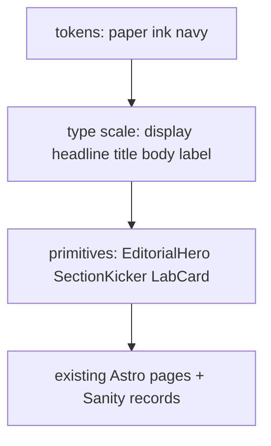

# Lab theme: research and implementation spec

**Audience:** Jonas / implementer. Julie does not edit this.  
**Date:** 21 September 2026  
**Status:** showable at `https://movenda-lab.onrender.com` (branch `archive/lab-look`). Movenda's written spec continues from this look on a new branch and a second URL, so this address stays the LAB version. See `DECISIONS.md`.  
**Switch already in code:** `PUBLIC_THEME=current|lab` in [`web/src/lib/site.ts`](web/src/lib/site.ts). Navy QR preview stays `current`.

This is a layout system we own. Julie still edits records in Sanity (team, hours, prices, photos, copy). No visual page builder.

---

## 1. What we are stealing, and what we are not

Julie pointed at two live sites. Inspected in the browser on 21 Sept 2026 (computed styles, not marketing copy).

### LAB Antwerp ([lab-antwerp.com](https://lab-antwerp.com/))

| What they do | Computed / observed |
|---|---|
| Type | **Akkurat** (Lineto, commercial) for UI and small caps; **Nuckle** (display) loaded |
| Color | Near-black field, white type, photography as the color |
| IA | Numbered nav: `01 LAB` `02 Training` `03 Physio` `04 Longevity` `05 Recovery` |
| Layout | Extreme air, hairline rules, small tracked labels (`OUR SERVICES` at 14px / 0.86px tracking), full-bleed photo, little chrome |
| Motion | Quiet. Content does the work |

**Take:** numbered kickers, editorial quiet, photo-first, no pill UI.  
**Do not take:** Akkurat, Nuckle, their logo, their black-on-black clinic look as the default (harder for older patients, worse on sunny phones, fights the Movenda wordmark).

### The Brick ([thebrick.be](https://thebrick.be/))

| What they do | Computed / observed |
|---|---|
| Display sans | **Acumin Pro Condensed** 800, tight tracking (`welcome to the brick`, 35px / −1.22px) |
| Display / body serif | **PP Editorial New Light** (`Build your life.`, 30px) |
| Paper | Body background `rgb(244, 244, 237)` ≈ `#f4f4ed` |
| Ink on photo | Cream type `rgb(239, 237, 230)` ≈ `#efede6` |
| Layout | Huge mixed-case headlines, full-bleed clubs, magazine scale, dark cinematic crops |

**Take:** paper + ink, condensed shout vs light serif, photo as a full column, one membership-grade confidence.  
**Do not take:** Acumin (Adobe), PP Editorial New (Pangram Pangram, paid), the looping “apply now” ticker, gym-club IA.

### Legal / brand line

Inspire structure. Do not clone their type, logo, or CSS. Movenda keeps its own marks (`/brand/logo-wordmark.png`, `/brand/logo-mpc.png`) and a reserved navy so the site still reads as the practice, not as a LAB or Brick franchise.

---

## 2. Recommended approach (one sentence)

**Keep one Astro repo and one Sanity dataset. Express the new look as tokens + a short type scale + three layout primitives. Add one free variable serif. Do not add a motion library, a component kit, or a paid font.**

Why this, not a second app or a CSS-only tint:

- `PUBLIC_THEME=lab` already flips `html[data-theme=lab]`. The first pass only recolors pills. That is not LAB/Brick.
- Rewriting every page is how the 10 hours in offerte-blok 2 disappear.
- Tokens + primitives (hero, kicker, card) change 45 pages without Julie touching layout.
- Lighthouse 90–99 on the pitch is a sold fact. GSAP / Lenis / Locomotive would buy smoothness and spend it on LCP.

---

## 3. Typography

### What the references actually use (paid: do not install)

| Role on their site | Face | License | Verdict |
|---|---|---|---|
| LAB UI | Akkurat | Lineto, commercial | No |
| LAB display | Nuckle | Commercial | No |
| Brick shout | Acumin Pro Condensed | Adobe Fonts, commercial | No |
| Brick editorial | PP Editorial New | Pangram Pangram, commercial | No |
| “Swiss grotesque” lookalikes | Neue Montreal | Pangram Pangram, commercial | No |

Apple HIG ([Typography](https://developer.apple.com/design/human-interface-guidelines/typography), updated Dec 2025): use few typefaces; prefer Regular–Bold over Thin/Light at small sizes; custom fonts must stay legible and should scale when the user enlarges text; SF + New York is their sans + serif pairing, both variable with optical size.  
Material 3 ([Type scale](https://m3.material.io/styles/typography/type-scale-tokens)): five roles (display, headline, title, body, label); brand face for large, plain face for small; variable fonts for editorial; rem on web; do not invent 12 similar sizes.

### What we ship (OFL, self-hosted, Dutch-safe)

Two families. Apple’s “minimize typefaces.” Material’s brand + plain.

| Role | Face | Package | Why |
|---|---|---|---|
| **Plain / UI / body** | Instrument Sans (already installed) | `@fontsource-variable/instrument-sans` | Grotesk with `wght` + `wdth`. Condensed axis covers Brick’s Acumin role without a third file. `latin-ext` covers é ë ij à. |
| **Brand / display** | Newsreader | `@fontsource-variable/newsreader` **add this** | Literary serif with `opsz` + `wght`, italic. Closest *free* stand-in for PP Editorial New + Apple New York. OFL. `latin-ext`. |

Bricolage Grotesque stays loaded for `PUBLIC_THEME=current` (QR / navy). Lab pages do not use it. Do not delete the package.

**Rejected alternatives**

| Face | Why not |
|---|---|
| Fraunces | OFL and beautiful, but Soft/Wonky axes read playful. Wrong for a clinic. |
| Geist | OFL, good grotesque, but Instrument Sans already does this and has `wdth`. Extra bytes, no new role. Geist static package is latin-only (weaker Dutch). |
| Source Serif 4 | OFL, solid, heavier files, less “magazine” than Newsreader. |
| Inter / Roboto | Material default. Reads as a dashboard, not a visiting card. |

### Type scale (lab)

Root `1rem` = browser default (16px). Never lock `html { font-size: 14px }`. That fights Apple Dynamic Type / user zoom and Google’s rem guidance.

| Token | Face | Size | Weight | Tracking | Line | Use |
|---|---|---|---|---|---|---|
| `--text-display` | Newsreader, `opsz` display | `clamp(2.75rem, 1.2rem + 5.5vw, 5.5rem)` | 400–500 | −0.03em | 0.96 | Page H1 |
| `--text-display-sans` | Instrument Sans `wdth` 75–85 | `clamp(2.25rem, 1rem + 4vw, 4rem)` | 650–750 | −0.04em | 0.95 | Optional shout line (“Performance”) |
| `--text-headline` | Newsreader | `clamp(1.75rem, 1.2rem + 1.4vw, 2.5rem)` | 500 | −0.02em | 1.15 | Section H2 |
| `--text-title` | Instrument Sans | 1.125–1.25rem | 600 | −0.01em | 1.25 | Card titles, H3 |
| `--text-body` | Instrument Sans | 1.0625rem (17px, Apple iOS default) | 400–500 | 0 | 1.5 | Running copy. Min 1rem. |
| `--text-label` | Instrument Sans | 0.75rem | 600 | 0.14em | 1.3 | `01` kickers, uppercase |

Rules from Apple / Google we will enforce:

- No weight below 400 for body or labels. Thin serif only at display size.
- `text-wrap: balance` on headings, `pretty` on paragraphs (already in [`web/src/styles/global.css`](web/src/styles/global.css)).
- Body line-height ≥ 1.5 (readable columns). Display can go to 0.95.
- Respect `prefers-reduced-motion`. No scroll-hijack.
- Tap / click targets ≥ 44×44 px (Apple HIG). Current 36px menu button needs a lab bump.

---

## 4. Color

### Roles (Material 3 idea, Movenda names)

Do not generate a full Material dynamic scheme from wallpaper. Do assign **paired** colors so text always has an “on-” partner.

| Role | Hex | On | Use |
|---|---|---|---|
| `paper` | `#f3eee4` | `ink` | Page background (Brick paper, slightly warmer) |
| `paper-deep` | `#ebe4d6` | `ink` | MPC page wash, so the two locations still differ |
| `surface` | `#fffdf8` | `ink` | Cards, dropdowns |
| `ink` | `#161513` | `paper` | Text, filled CTAs, footer |
| `ink-soft` | `#4f4a42` | `paper` | Muted. Must stay ≥ 4.5:1 on paper (verify before ship) |
| `line` | `#d8d0c2` | — | Hairlines, not as text |
| `navy` | `#1470af` | `#ffffff` | Reserved brand. Focus rings, “Bel …” if a color CTA is needed, review-star fallback |
| `navy-deep` | `#0d5a8a` | `#ffffff` | Hover on navy |
| `gold` | `#c4a265` | `ink` | Stars only, never body text |
| `on-photo` | `#efede6` | photo + scrim | Type on heroes (Brick cream) |

Ink on paper is the default CTA (LAB). Navy is the *Movenda* signal, used sparingly so logos do not float in a foreign system.

**Not doing:** a second dark theme for MPC. One paper system. MPC is a deeper paper, not a nightclub. Dark footer is enough contrast at the bottom.

### Contrast (WCAG 2.2 AA, Apple Accessibility Inspector, Material)

| Pair | Need |
|---|---|
| Body / labels on paper | ≥ 4.5:1 |
| Display / ≥ 18pt or 14pt bold | ≥ 3:1 |
| Button fill vs page | ≥ 3:1 for the shape; label vs fill ≥ 4.5:1 |
| Focus ring | Visible on paper and on photo. Navy 3:1 against both, or ink ring + offset |

Apple also: do not communicate state by color alone (current nav = weight + underline, not only blue). Test in bright light: paper must not wash out to “broken white.”

`prefers-contrast: more` (lab): darken `ink-soft` toward `ink`, thicken `line`.

---

## 5. Packages

Hard rule ([`AGENTS.md`](AGENTS.md), [`STACK.md`](STACK.md)): no new paid SaaS / npm / hosting without founder OK. Sanity free + Fontsource OFL is enough.

### Add

| Package | Cost | Why |
|---|---|---|
| `@fontsource-variable/newsreader` | €0, OFL | Only new dependency. Import `opsz` + `wght` + italic, `latin` + `latin-ext`. Self-hosted, no Google Fonts runtime request (Brick loads Google Fonts behind a cookie wall; we will not). |

Load Newsreader **only when `THEME === "lab"`** so the QR navy bundle does not grow.

### Already enough (do not add)

| Package | Role |
|---|---|
| `@fontsource-variable/instrument-sans` | Body + condensed shout |
| `@fontsource-variable/bricolage-grotesque` | Current theme only |
| Tailwind 4 + `@theme` | Tokens |
| Astro `<Image>` + Sanity CDN | Crops, no extra image lib |
| `astro:assets` `getImage` | LCP preload (already on home) |

### Do not add

| Package | Why |
|---|---|
| GSAP / ScrollTrigger | Club GreenSock is paid. Hurts LCP. Apple: honor reduced motion. |
| Lenis, Locomotive Scroll | Hijacks scroll. Accessibility and iOS rubber-banding suffer. |
| Framer Motion / React Spring | We are not a React app. |
| `@material/web` / MUI | Wrong language (filled cards, 4px radius, Roboto). |
| Adobe Fonts / Pangram Pangram / Lineto | Paid. Founder OK required. Not needed if Newsreader + Instrument hold. |
| `open-props`, `shadcn` | Extra design system on top of ours. |
| Cookie-gated Google Fonts CSS | Extra connection, GDPR theatre, FOIT. Fontsource is the point. |

Dev-only, already implied: Lighthouse, `astro check`. Contrast: browser DevTools or a one-off script, not a runtime package.

---

## 6. Apple and Google, mapped to this site

We are a static marketing site, not an iOS app. Still bind the rules that transfer.

| Source | Rule | What we do |
|---|---|---|
| Apple HIG Typography | Few faces, no thin small text, 17pt-class body | Two faces. Body 17px. Display serif never below 400 except at huge size |
| Apple HIG Typography | Custom fonts must remain legible when text is enlarged | `rem` + `clamp`. No px-locked headings that overflow at 200% zoom |
| Apple Accessibility | Enlarge text ~200%; contrast AA | Check `/mpc` and `/contact` at 200% zoom. Paper/ink pairs above |
| Apple HIG | 44pt minimum hit target | Lab header CTA and hamburger ≥ 44px |
| Apple Color | Test in bright light; don’t rely on color alone | Paper not `#fff`. Current state = underline + weight |
| Material 3 type | display / headline / title / body / label | Tokens in §3. Not all 15 styles |
| Material 3 color | Paired “on-” roles | Table in §4 |
| Material 3 contrast | 4.5:1 text, 3:1 large and UI | Same as WCAG 2.2 AA (also what Lighthouse flags) |
| Google web vitals | LCP < 2.5s, already sold | No hero fade-in on the LCP image (current home already avoids this). Lab heroes: `priority` + preload, no opacity animation on the photo |
| Google fonts guidance | Self-host, subset | Fontsource `latin-ext` only. `font-display: swap` (Fontsource default) |

Core Web Vitals stay a product promise ([`OFFERTE.md`](OFFERTE.md) Lighthouse table). Theme work that drops mobile performance below 90 is not done.

---

## 7. Layout language (primitives)

Do not restyle 45 pages by hunting `rounded-full`. Add three components and point existing pages at them.

1. **`EditorialHero`**  
   Full-bleed or half-bleed photo, cream type + bottom scrim on small screens, Newsreader H1, Instrument kicker, two CTAs (ink fill + ink outline). Replaces the navy-chip hero on MPC home first.

2. **`SectionKicker`**  
   Already exists ([`web/src/components/SectionKicker.astro`](web/src/components/SectionKicker.astro)). Keep `01` `02` as *section* labels, not as a clone of LAB’s entire nav.

3. **`LabCard`**  
   Hairline `line`, 2px radius, no drop shadow, Newsreader-optional title. `DienstCard`, pillar tiles, FAQ rows opt in via a class or a thin wrapper.

Grid: 12-column, max 72–80rem, more asymmetric than today’s `max-w-6xl` + 2-col. One full-bleed photo per major section (Brick), then a numbered text block (LAB).

Header: paper bar, ink type, hairline bottom. No navy slab. Footer: ink field, paper type, same as now structurally.

---

## 8. Implementation order

Fits the live plan: MPC this week stays **navy + noindex**. Lab is the parallel share URL.

| Slice | What | Done when |
|---|---|---|
| 0 | This spec. No new paid font | You are here |
| 1 | Install Newsreader, lab-only import, tokens + type scale in CSS, contrast check | `data-theme=lab` uses the table in §3–4. QR bundle unchanged |
| 2 | `EditorialHero` on MPC home NL + EN | Looks like a magazine cover, not a recolored card |
| 3 | Team (MPC filter), contact, MPC prijzen, groepslessen | Same chrome. Form still works |
| 4 | `LabCard` on diensten | Cards lose the Tailwind “startup” radius |
| 5 | Movenda home + kine/training | After MPC is shareable |
| 6 | Flip `PUBLIC_THEME=lab` on `movenda-mpc` when they OK | QR stays `current` |

Blok 2 of the offerte is 10 hours. Slices 1–3 are the honest “naar wens” restyle. 4–6 are extra or the yearly day.

---

## 9. What is already in the repo (so we do not redo it)

- `PUBLIC_THEME` / `data-theme` on `<html>` ([`web/src/layouts/Layout.astro`](web/src/layouts/Layout.astro))
- Paper/ink token draft and sharp buttons in [`web/src/styles/global.css`](web/src/styles/global.css) (first pass; scale and Newsreader still missing)
- `SectionKicker` on MPC home
- Host mode for `mpc.movenda.be` (out of scope for look)

The first pass is a **recolor**. This document is the brief for turning that into a **system**.

---

## 10. Checks before we call a slice done

- Contrast: ink, ink-soft, navy-on-white, cream-on-scrim
- 200% zoom: header and CTAs do not collide
- `prefers-reduced-motion`: no required motion
- Lighthouse mobile on `/mpc` and `/` (lab build): Performance ≥ 90, LCP photo not faded
- Dutch glyphs in Newsreader display (`ë`, `ij`, `é`)
- Julie can still change a hero photo in Sanity without us
- QR preview (`current`) screenshot-identical in chrome

---

## Sources

- Live computed styles: [lab-antwerp.com](https://lab-antwerp.com/) (Akkurat, Nuckle, numbered nav), [thebrick.be](https://thebrick.be/) (Acumin Condensed, PP Editorial New, paper `#f4f4ed`), 21 Sept 2026
- [Apple HIG: Typography](https://developer.apple.com/design/human-interface-guidelines/typography) (Dec 2025 update noted in-page)
- [Apple HIG: Accessibility](https://developer.apple.com/design/human-interface-guidelines/accessibility) (contrast, 200% text, Dynamic Type)
- [Material 3: Typography](https://m3.material.io/styles/typography/overview) and [type scale tokens](https://m3.material.io/styles/typography/type-scale-tokens)
- [Material 3: Color contrast](https://m3.material.io/foundations/designing/color-contrast)
- Fontsource: [Newsreader](https://www.npmjs.com/package/@fontsource-variable/newsreader) (OFL, opsz), [Instrument Sans](https://www.npmjs.com/package/@fontsource-variable/instrument-sans) (already in tree)
- WCAG 2.2 AA contrast (4.5:1 / 3:1), same numbers Apple’s Accessibility Inspector cites
